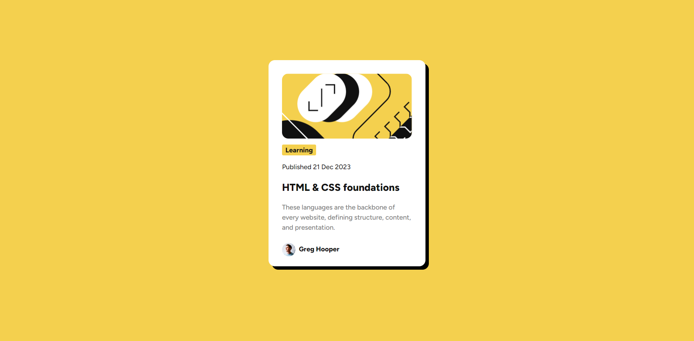

# Frontend Mentor - Blog preview card solution

This is a solution to the [Blog preview card challenge on Frontend Mentor](https://www.frontendmentor.io/challenges/blog-preview-card-ckPaj01IcS). Frontend Mentor challenges help you improve your coding skills by building realistic projects.

## Table of contents

- [Overview](#overview)
  - [The challenge](#the-challenge)
  - [Screenshot](#screenshot)
  - [Links](#links)
- [My process](#my-process)
  - [Built with](#built-with)
  - [What I learned](#what-i-learned)
  - [Continued development](#continued-development)
  - [Useful resources](#useful-resources)
- [Author](#author)
- [Acknowledgments](#acknowledgments)

**Note: Delete this note and update the table of contents based on what sections you keep.**

## Overview

### The challenge

Users should be able to:

- See hover and focus states for all interactive elements on the page

### Screenshot



### Links

- Solution URL: [github.com/RayyanNafees/fm-lvl-3](https://github.com/RayyanNafees/fm-lvl-3)
- Live Site URL: [rayyannafees.github.io/fm-lvl-3](https:rayyannafees.github.io/fm-lvl-3)

## My process

### Built with

- Semantic HTML5 markup
- CSS box-shadow

### What I learned

I learnt that it quickly becomes complex to handle all the spacing and font size values as css grows big

So in keep things consistent, we should predefine them in css variables in the theme

```css
:root {
  /* Spacing */
  --space-xxs: 0.5rem;
  --space-xs: 1rem;
  --space-sm: 1.5rem;
  --space-md: 2rem;
  --space-lg: 3rem;
  --space-xl: 4rem;
  --space-xxl: 5rem;

  /* Radius */
  --border-radius: 0.5rem;
}
```

I also learnt the importance of devtools when u get suck in identifying spaces, paddings and margins

### Continued development

I would like to continue development in handling the spacing and using them with css vars effectively

## Author

- Website - [rayyannafees.github.io](https://rayyannafees.github.io)
- Frontend Mentor - [@RayyanNafees](https://www.frontendmentor.io/profile/RayyanNafees)
- Twitter - [@NafeesRayyan](https://www.twitter.com/NafeesRayyan)
